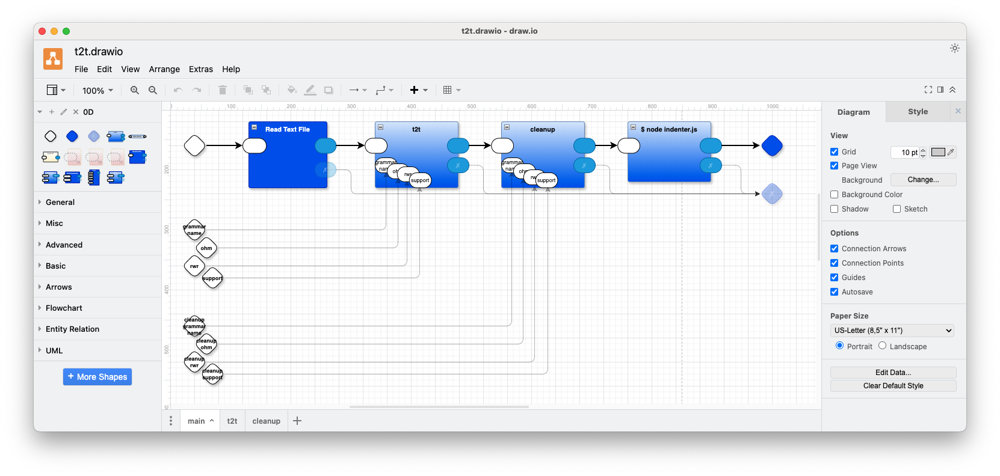

# t2t transpiler tool
- t2t tool - text to text transpiler
- inhales 'in.txt' and exhales transpiled text according to the grammars and rewrite rules
- you need to supply 2 grammars and 2 corresponding rewrite scripts
- input is the source text to be converted, output is the converted source
- this tool parses the input text using the 1st grammar then rewrites it per the 1st rwr (rewrite) script
- then the rewritten text is passed through one more grammar+rwr to do simple rewrites - like using sed and REGEXs to 
  clean up the output, but the grammar+rwr combination is more powerful and can pattern match "structured" text
- and you need to specify support (JS) files, if needed (in most cases 'null.js' is sufficient) [details elsewhere]

## concept
- the tool inhales source text, parses it according to the main grammar, then rewrites the text according to the RWR (ReWRite script), then passes the transpiled text to a cleanup pass, the twice-transpiled text is sent through an indenter to format the output code ("pretty print" for structured languages, vital for Python-like languages)
- the cleanup pass parses the transformed text and tweaks it according to the cleanup RWR script
  - for example, many languages insist that commas are significant. So, if t2t is used to emit code in one of those languages, the emitted code needs to have just
    the right number of commas in it, and must not have a comma after the last element in a list. In such cases, the cleanup pass can delete superfluous commas. If not needed, the cleanup pass can be stubbed out on the diagram by feeing inputs directly to outputs.
- After the two parsing/rewriting passes, the code is further filtered by an indenter. The indenter converts the unicode characters "⤷" into indents and "⤶" into outdents
  - the RWR (rewrite) scripts can emit code that contains indent and outdent characters to make the final code easier to read, or, to make the code compatible with indentation-based languages, like Python.
  - At present, indents produce a fixed number of spaces. The amount is currently hard-wired into the indent.js code. This amount should be easy to change on a per-project basis by editing the 'indent.js' program.

# diagram of the tool

# usage
- run 'make' at the command line, you should see a JSON structure printed on the console

- at present, this is just a simple example of t2t 

# example
- in the Makefile rule 'all', we see the line:

		python3 main.py . 0D/python swibasm null.js cleanup null.js in.txt main t2t.drawio.json transpile.drawio.json

	- which takes input source from in.txt and outputs the twice rewritten text to stdout
	- the example source file is "in.txt", it contains code the is lisp-flavoured (actually RT - Recursive Text), and that code is converted to .json format
		- 'in.txt' is supposed to be a simple "assembler" source with opcodes targeted at parsing text, the .json output is "assembler" written in JSON format
	- the cleanup pass removes superfluous commas at the end of Python lists, i.e ,...] => ...] (where "..." is whitespace)
	- in this example, the main grammar is "swibasm" which is sent to the tool as 1 string "swibasm" and is converted into 2 filenames "swibasm.ohm", and, "swibasm.rwr"
		- the support file for the main grammar is 'null.js'
		- and, the cleanup grammar is "cleanup", which produces 1 string and "cleanup" and is converted into 2 filenames "cleanup.ohm", and, "cleanup.rwr"
	- the grammars are written in OhmJS format (see ohmjs.org)
	- the rewrite scripts are written in RWR format (TBD - should be fairly obvious, though)
	- 'null.js' is an "empty" JS namespace (Just copy it for now. Later, look at examples of support files written in JS - ask me for info).
	- you don't need to know the following to use this tool, but for the record:
		- 'main.py' is the main driver code for this tool, written in Python (other languages available - ask me)
		- '.' is the path of the current working directory
		- '0D/python' is a path to some library code used by this tool
		- 'main' is the tab-name of the main diagram (see the diagram above, see t2t.drawio (use the draw.io editor https://app.diagrams.net))
		- 't2t.drawio.json' is a json-ified version of the semantically interesting parts of the t2t diagram, created by the das2json tool
		- 'transpile.drawio.json' is a json-ified version of the semantically interesting parts of some library code used by this tool, created by the das2json tool

# Odin
- The main workhorse of this tool is the Transpile component, found in the standard library for 0D.
- The Transpile component works in the Odin version of 0D (in fact, Transpile was developed with Odin0D).
- I haven't tested this t2t tool with Odin0D, but, I believe that it will, also, work with Odin0D. The .ohm and .rwr files should require no porting for use with Odin0D.

I am happy to answer questoins:
find me on Discord https://discord.gg/UJWjhFJN
email me at: ptcomputingsimplicity@gmail.com
